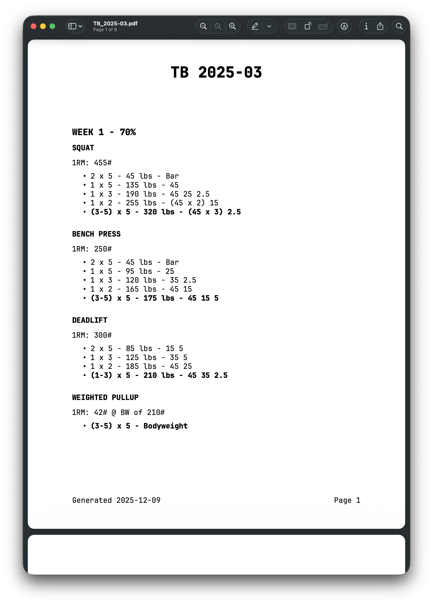

# TBWeightCalc
### Tactical Barbell Max Strength Calculator + PDF Generator  
**Command:** `tbcalc`

TBWeightCalc is a command-line tool for generating *Tactical Barbell Max Strength* programming sheets from your 1RM values. It outputs:

- Clean, readable **Markdown**
- Auto-copied **clipboard output** (macOS)
- A fully formatted **PDF** with:
  - Centered title  
  - JetBrainsMono Nerd Font Mono  
  - Page numbers  
  - Date footer  
  - Automatic page breaks  
  - Clean layout optimized for printing  

It is designed for speed, clarity, and usability — perfect for Tactical Barbell strength cycles.

Sample output

```
# Tactical Barbell Max Strength: 2025-12-09

## WEEK 1 - 70%

### SQUAT

1RM: 455#

- 2 x 5 - 45 lbs - Bar
- 1 x 5 - 135 lbs - 45
- 1 x 3 - 190 lbs - 45 25 2.5
- 1 x 2 - 255 lbs - (45 x 2) 15
- **(3-5) x 5 - 320 lbs - (45 x 3) 2.5**


### BENCH PRESS

1RM: 250#

- 2 x 5 - 45 lbs - Bar
- 1 x 5 - 95 lbs - 25
- 1 x 3 - 120 lbs - 35 2.5
- 1 x 2 - 165 lbs - 45 15
- **(3-5) x 5 - 175 lbs - 45 15 5**


### DEADLIFT

1RM: 300#

- 2 x 5 - 85 lbs - 15 5
- 1 x 3 - 125 lbs - 35 5
- 1 x 2 - 185 lbs - 45 25
- **(1-3) x 5 - 210 lbs - 45 35 2.5**


### WEIGHTED PULLUP

1RM: 67# @ BW of 200#

- **(3-5) x 5 - Bodyweight**
```


### Sample PDF output

---

# 🚀 Features

- Computes weekly training sets for:
  - **Squat**
  - **Bench Press**
  - **Deadlift**
  - **Weighted Pull-Up** (1RM + bodyweight)
- Generates:
  - **All 6 weeks** or a **single week**
  - **Markdown output**
  - **PDF output (via XeLaTeX + Pandoc)**
- Uses JetBrainsMono Nerd Font Mono for a highly readable layout
- Automatically copies Markdown to clipboard (macOS)
- One simple CLI command: `tbcalc`

---

# 📦 Installation Guide (macOS)

TBWeightCalc requires the following system dependencies:

### **Required**
- Python **3.10+**
- **pipx**
- **Pandoc**
- **XeLaTeX**
- LaTeX packages `fancyhdr` + `titling`
- **JetBrainsMono Nerd Font Mono**

Below are the macOS install steps.

---

## 1️⃣ Manual Developer Installation (macOS)

```bash
brew install pipx
pipx ensurepath

brew install pandoc
brew install --cask basictex
echo 'export PATH="/Library/TeX/texbin:$PATH"' >> ~/.zshrc
source ~/.zshrc

sudo tlmgr update --self
sudo tlmgr install fancyhdr titling

brew install --cask font-jetbrains-mono-nerd-font

pipx install tbweightcalc
```

## Install script
```bash
/bin/bash -c "$(curl -fsSL https://raw.githubusercontent.com/zachbanks/tbweightcalc/main/install_tbcalc.sh)"
```


## Upgrade
To upgrade to the latest version, run
```bash
pipx upgrade tbweightcalc
```

---

# ⚙️ Configuration

TBWeightCalc supports customization through YAML configuration files. This allows you to personalize weight formatting, default values, and output preferences without modifying code.

## Configuration File Locations

TBWeightCalc looks for configuration in the following order:

1. **Custom config** (if specified with `--config` flag)
2. **User config**: `~/.config/tbcalc/config.yaml`
3. **Default config**: Built-in defaults

## Creating Your Config File

Create a config file at `~/.config/tbcalc/config.yaml`:

```bash
mkdir -p ~/.config/tbcalc
nano ~/.config/tbcalc/config.yaml
```

## Configuration Options

### Weight Formatting

Control how weights are displayed throughout the program:

```yaml
formatting:
  # Weight unit format - choose how weights appear in output
  # Options: "lbs", "pounds_sign" (#), "pounds"
  weight_unit: "lbs"          # Default: "lbs"

  # Examples:
  # "lbs"          → "135 lbs"
  # "pounds_sign"  → "135#"
  # "pounds"       → "135 pounds"

  # Show decimal places for whole number weights
  show_weight_decimals: false  # Default: false

  # Text used in custom bar weight indicators
  # Example: "SQUAT (35# bar)" or "SQUAT (35 lbs barbell)"
  bar_indicator: "bar"         # Default: "bar"
```

### Default Values

Set default values for common parameters:

```yaml
defaults:
  # Standard barbell weight in pounds
  standard_bar_weight: 45.0    # Default: 45.0

  # Default body weight for weighted pull-ups (optional)
  body_weight: null            # Default: null (prompt user)
```

### Output Preferences

Customize output behavior and locations:

```yaml
output:
  # Directory where PDFs are saved
  pdf_output_dir: "~/Downloads"  # Default: "~/Downloads"

  # Default title template ({date} is replaced with current date)
  default_title: "Tactical Barbell Max Strength: {date}"

  # Date format for titles (Python strftime format)
  date_format: "%Y-%m-%d"      # Default: "%Y-%m-%d"

  # Automatically copy output to clipboard (macOS only, requires pbcopy)
  copy_to_clipboard: true      # Default: true
```

### Week Percentages

Customize the 6-week progression percentages:

```yaml
week_percentages:
  1: 70  # Week 1: 70% of 1RM
  2: 80  # Week 2: 80% of 1RM
  3: 90  # Week 3: 90% of 1RM
  4: 75  # Week 4: 75% of 1RM (deload week)
  5: 85  # Week 5: 85% of 1RM
  6: 95  # Week 6: 95% of 1RM
```

### Available Plates

Define which plates are available for breakdown calculations:

```yaml
available_plates:
  - 45    # Standard 45lb plates
  - 35    # 35lb plates
  - 25    # 25lb plates
  - 15    # 15lb plates
  - 10    # 10lb plates
  - 5     # 5lb plates
  - 2.5   # 2.5lb plates (fractional plates)
```

## Example Configurations

### Minimal Config (Pound Sign Format)

```yaml
# ~/.config/tbcalc/config.yaml
formatting:
  weight_unit: "pounds_sign"  # Use # instead of lbs
```

### Powerlifting Gym Config

```yaml
# ~/.config/tbcalc/config.yaml
formatting:
  weight_unit: "pounds_sign"
  bar_indicator: "barbell"

defaults:
  standard_bar_weight: 45.0

# Only standard plates available
available_plates: [45, 25, 10, 5, 2.5]
```

### Home Gym Config

```yaml
# ~/.config/tbcalc/config.yaml
formatting:
  weight_unit: "lbs"

defaults:
  standard_bar_weight: 45.0

output:
  pdf_output_dir: "~/Dropbox/Training"
  copy_to_clipboard: false

# Limited plate selection for home gym
available_plates: [45, 25, 10, 5]
```

## Using Custom Config Files

You can specify a custom config file location using the `--config` flag:

```bash
# Use a specific config file
tbcalc -sq 455 --config ~/my-training/custom-config.yaml

# Use config from different location
tbcalc -sq 455 --config /tmp/test-config.yaml
```

## Config Priority

Settings are applied in this order (later overrides earlier):

1. Built-in defaults (from `default_config.yaml`)
2. User config (`~/.config/tbcalc/config.yaml`)
3. Custom config (specified with `--config`)
4. Command-line arguments (e.g., `--title`, `--pdf`)

---
